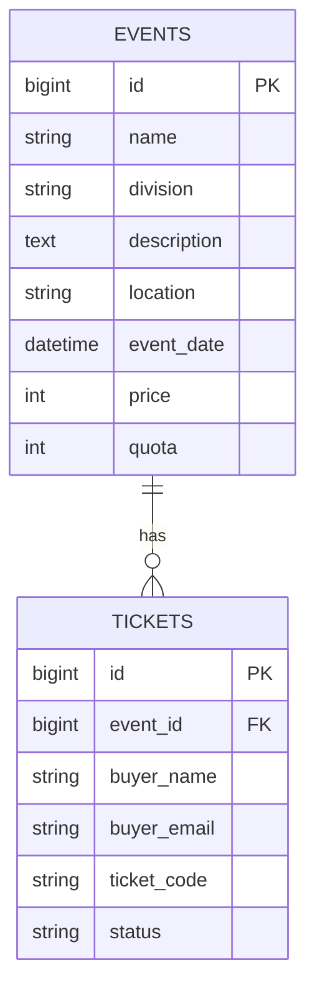

# Pulse Arena

Sistem pemesanan tiket untuk kompetisi robotik. Pengunjung bisa melihat daftar event, memesan tiket, dan melihat tiket yang sudah dipesan. Ada juga halaman admin untuk mengelola event.

**Opsi pengerjaan: Opsi 3 (Fullstack)**

## Tema

Pulse Arena adalah platform tiket untuk turnamen robotik dengan empat divisi: combat robot, line follower, drone racing, dan robo-soccer. Nama "pulse" diambil dari sinyal PWM yang dipakai untuk menggerakkan motor dan servo di robot. Tampilannya dibuat gelap dengan aksen biru, seperti panel instrumen.

## Stack

- **Backend:** Laravel 13 (PHP 8.5), REST API
- **Database:** PostgreSQL
- **Frontend:** Blade, Bootstrap 5, CSS custom, AOS. Data diambil dari API lewat `fetch()`

Saya memakai Laravel dan Bootstrap karena itu yang paling saya kuasai. Dengan waktu 24 jam, saya lebih memilih aplikasi yang jalan utuh daripada mencoba stack baru dan berakhir setengah jadi.

## Fitur

**Halaman pengunjung**

- Daftar event dan halaman detail event
- Pemesanan tiket dengan validasi nama dan email
- Pemesanan ditolak jika event sudah lewat atau kuota habis
- Halaman tiket: menampilkan semua tiket yang sudah dipesan, bisa difilter berdasarkan email dan status

**Halaman admin**

- Daftar event dalam bentuk tabel, lengkap dengan jumlah tiket terjual dibanding kuota
- Kartu ringkasan event dengan tiket terbanyak dan terendah
- Tambah event lewat form, dengan validasi
- Edit event
- Hapus event (ada konfirmasi dulu, dan ditolak kalau event sudah punya tiket)

**Tampilan**

- Dark Mode dan Light Mode dengan tombol pergantian tema.
- Preferensi tema disimpan menggunakan `localStorage`, sehingga tetap tersimpan saat halaman dibuka kembali.
- Warna antarmuka menyesuaikan tema menggunakan CSS Variables.

**API**

- CRUD event
- Pemesanan tiket dan daftar tiket dengan filter
- Endpoint ranking event

Halaman admin belum memakai login. Link-nya juga sengaja tidak dipasang di navigasi pengunjung, jadi dibuka lewat alamat langsung.

## Halaman

| URL | Isi |
|---|---|
| `/` | Daftar event |
| `/events/{id}` | Detail event dan form pemesanan tiket |
| `/tickets` | Daftar tiket dengan filter email dan status |
| `/admin/events` | Kelola event: tabel, ringkasan, hapus |
| `/admin/events/create` | Form tambah event |
| `/admin/events/{id}/edit` | Form edit event |

## Cara menjalankan

```bash
git clone https://github.com/rosyidmuwaffaq/pulse-arena.git
cd pulse-arena
composer install
copy .env.example .env
php artisan key:generate
```

Buat database PostgreSQL bernama `arena_rx`, lalu isi `DB_USERNAME` dan `DB_PASSWORD` di `.env`. Setelah itu:

```bash
php artisan migrate
php artisan serve
```

Buka `http://127.0.0.1:8000`. Untuk halaman admin, buka `http://127.0.0.1:8000/admin/events`. Struktur tabel juga tersedia di `database/schema.sql`.

## Endpoint API

| Method | URL | Keterangan |
|---|---|---|
| GET | `/api/events` | Daftar event, lengkap dengan jumlah tiket terjual |
| POST | `/api/events` | Tambah event |
| GET | `/api/events/{id}` | Detail event |
| PUT | `/api/events/{id}` | Ubah event |
| DELETE | `/api/events/{id}` | Hapus event (ditolak jika sudah ada tiket) |
| GET | `/api/events/ranking` | Event dengan tiket terbanyak dan terendah |
| POST | `/api/events/{id}/tickets` | Pesan tiket |
| GET | `/api/tickets` | Daftar tiket. Filter: `event_id`, `email`, `status` |

Event yang tidak ditemukan mengembalikan 404. Data yang tidak valid mengembalikan 422 beserta pesan per field. Menghapus event yang sudah punya tiket mengembalikan 409.

## Database

Satu event punya banyak tiket (one-to-many), dihubungkan lewat `tickets.event_id`.



Foreign key memakai `RESTRICT`. Tiket adalah data transaksi, jadi event tidak boleh terhapus begitu saja selama masih ada tiket di dalamnya.

Kolom `status` pada tiket bernilai `valid` secara default. Filter di halaman tiket juga menyediakan `used` dan `cancelled`, tapi belum ada fitur yang mengubah status tiket ke nilai itu.

## Struktur project

```
app/
  Http/Controllers/Api/   EventController, TicketController
  Http/Requests/          validasi (Store/Update event, Store ticket)
  Models/                 Event, Ticket
database/
  migrations/
  schema.sql
public/
  css/, js/               gaya dan helper JavaScript (fungsi api(), format rupiah dan tanggal)
resources/views/
  layouts/                app (pengunjung) dan admin
  events/                 daftar dan detail event
  tickets/                daftar tiket
  admin/events/           tabel, tambah, dan edit event
routes/                   api.php dan web.php
```

## Keputusan teknis

- **Form Request** untuk validasi, supaya controller tetap pendek.
- **Transaksi dan `lockForUpdate()`** saat memesan tiket. Tanpa itu, dua orang yang memesan tiket terakhir di saat bersamaan bisa sama-sama lolos cek kuota.
- **Kode tiket dibuat server**, bukan dari input user.
- **Aturan bisnis ada di backend.** Frontend hanya menampilkan hasilnya, jadi aturan tidak bisa dilewati dengan memanggil API langsung.
- **Halaman admin dipisah** dari halaman pengunjung, dengan layout sendiri.

## Tantangan yang dihadapi

Kendala terbesar justru hal-hal kecil. Beberapa kali aplikasi error atau halaman jadi kosong cuma karena salah ketik, kurang satu tanda baca, atau file yang lupa di-save. Contohnya halaman detail event sempat putih polos, ternyata filenya belum tersimpan. Pernah juga folder view `tickets` belum kebuat, dan method `index` di controller ternyata belum masuk, jadi Laravel bilang method-nya tidak ditemukan.

Dari situ saya belajar membaca pesan error pelan-pelan, karena biasanya penyebabnya sudah disebut di situ (nama file, nama method, atau baris yang bermasalah). Saya juga jadi terbiasa cek `php artisan route:list` dan log Laravel dulu sebelum menebak-nebak.

## Yang ingin saya tingkatkan

- Login untuk admin, karena halaman admin sekarang terbuka untuk siapa saja yang tahu alamatnya
- Login untuk pengunjung, supaya halaman tiket hanya menampilkan tiket milik sendiri (sekarang semua tiket terlihat)
- Fitur mengubah status tiket (`used`, `cancelled`)
- Pembayaran
- Automated test untuk aturan pemesanan
- Pagination di daftar event dan daftar tiket