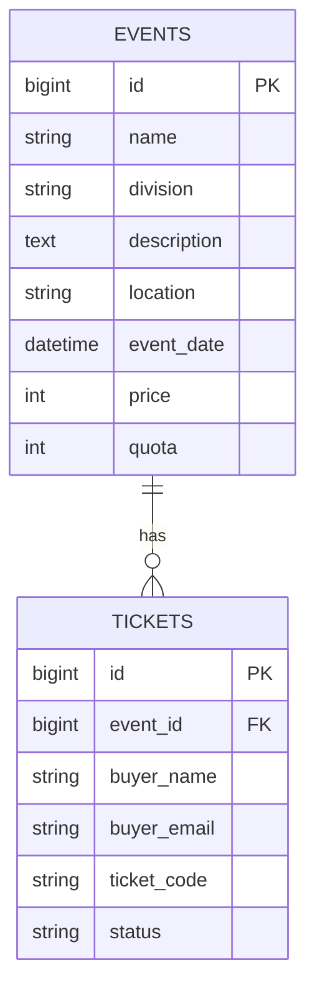

# Pulse Arena

Aplikasi pemesanan tiket untuk event kompetisi robotik: combat robot, line follower, drone racing, dan robo-soccer.

**Opsi pengerjaan: Opsi 3 (Fullstack).**

## Stack

- Backend: Laravel 13 (PHP 8.5) sebagai REST API
- Database: PostgreSQL
- Frontend: Blade, Bootstrap 5, CSS custom, dan AOS. Data diambil dari API lewat `fetch()`

Saya memilih Laravel dan Bootstrap karena itu stack yang paling saya kuasai, sehingga aplikasi bisa selesai utuh dalam waktu 24 jam.

## Fitur

- Daftar event dan detail event
- Pemesanan tiket dengan validasi nama dan email
- Tiket tidak bisa dipesan jika event sudah kedaluwarsa atau kuota habis
- Daftar tiket yang sudah dipesan, dengan filter `event_id`, `email`, dan `status`
- Event dengan tiket terbanyak dan terendah
- CRUD event (tambah, lihat, ubah, hapus)
- Event yang sudah memiliki tiket tidak bisa dihapus

## Cara menjalankan

1. Clone repo:
```bash
   git clone https://github.com/rosyidmuwaffaq/pulse-arena.git
   cd pulse-arena
```
2. Pasang dependency:
```bash
   composer install
```
3. Siapkan konfigurasi:
```bash
   copy .env.example .env
   php artisan key:generate
```
4. Buat database PostgreSQL bernama `arena_rx`, lalu isi `DB_USERNAME` dan `DB_PASSWORD` di `.env`.
5. Jalankan migration:
```bash
   php artisan migrate
```
6. Jalankan server:
```bash
   php artisan serve
```
   Buka `http://127.0.0.1:8000`.

Struktur tabel juga tersedia di `database/schema.sql`.

## Endpoint API

| Method | URL | Keterangan |
|---|---|---|
| GET | `/api/events` | Daftar event |
| POST | `/api/events` | Tambah event |
| GET | `/api/events/{id}` | Detail event |
| PUT | `/api/events/{id}` | Ubah event |
| DELETE | `/api/events/{id}` | Hapus event (ditolak jika sudah ada tiket) |
| GET | `/api/events/ranking` | Event dengan tiket terbanyak dan terendah |
| POST | `/api/events/{id}/tickets` | Pesan tiket |
| GET | `/api/tickets` | Daftar tiket, filter: `event_id`, `email`, `status` |

## Struktur database

Satu event memiliki banyak tiket (one-to-many), dihubungkan lewat `tickets.event_id`.



Foreign key memakai `RESTRICT`: event tidak bisa dihapus selama masih memiliki tiket, karena tiket adalah data transaksi yang tidak boleh hilang otomatis.

## Keputusan teknis

- Validasi dipisah ke Form Request agar controller tetap singkat.
- Pemesanan tiket memakai transaksi database dengan `lockForUpdate()`, supaya kuota tidak terlampaui saat dua orang memesan bersamaan.
- Kode tiket dibuat oleh server, bukan diisi oleh user.

## Tantangan yang dihadapi

## Tantangan yang dihadapi

Kendala terbesar justru hal-hal kecil. Beberapa kali aplikasi error atau halaman jadi kosong cuma karena salah ketik, kurang satu tanda baca, atau file yang lupa di-save. Contohnya halaman detail event sempat putih polos, ternyata filenya belum tersimpan. Pernah juga folder view `tickets` belum kebuat, dan method `index` di controller ternyata belum masuk, jadi Laravel bilang method-nya tidak ditemukan.

Dari situ saya belajar membaca pesan error dengan pelan-pelan, karena biasanya penyebabnya sudah disebut di situ (nama file, nama method, atau baris yang bermasalah). Saya juga jadi punya kebiasaan cek `php artisan route:list` dan log Laravel dulu sebelum menebak-nebak.

## Yang ingin saya tingkatkan

- Autentikasi user, sehingga halaman "Tiket Saya" tidak perlu pencarian lewat email
- Pembayaran dan status tiket yang lebih lengkap
- Automated test untuk aturan pemesanan
- Pagination pada daftar event